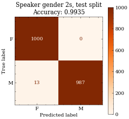
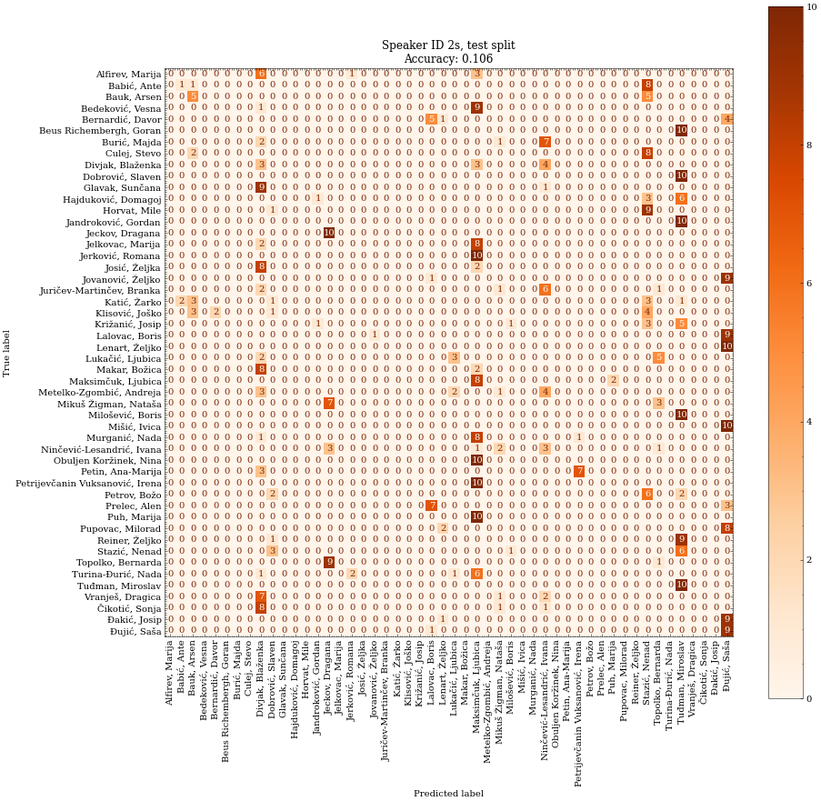
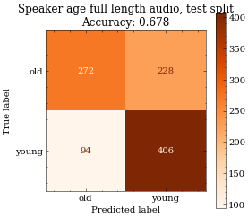
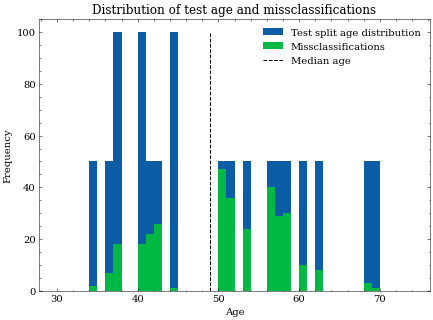
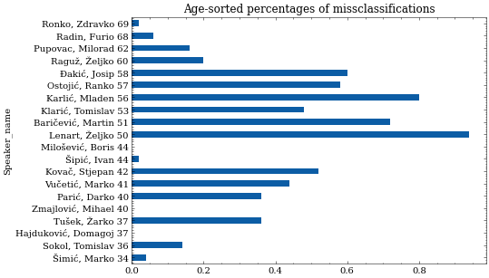
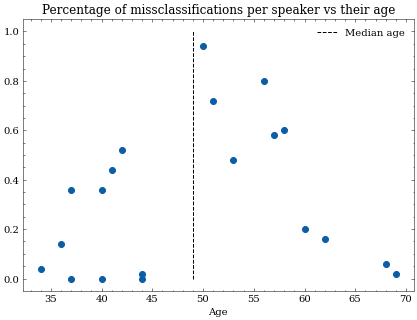

# task11

# Addendum 2022-05-09T11:16:48

Questions for Nikola:
* Train-dev-test or just train-test split?
* Do we take them all or just those where Speaker_role == MP?
* Even after pruning, the dataset is 1200 hours. When reducing, should I go for max nr of speakers?

# Addendum 2022-05-09T13:09:13

After rereading the paper: sampling should be different. 

# Meeting notes 2022-05-09T14:20:20
* Start with GENDER, train: 25 speakers per gender, 20 instances per speaker,  1000 instances
                     test: 200 instances from 5 speakers / gender, 20 instances per speaker
* Include speakers with 500 < instance_count < 3000
* Models: XLS, Slavic, something pretrained only on english (all pretrained) +  CLASSLA/Slavic finetuned (our checkpoint).

# Addendum 2022-05-10T11:50:26

The first model I trained was `facebook/wav2vec2-large-960h-lv60-self`, because Slavic does not have a tokenizer.

# Meeting notes 2022-05-13T10:21:13

1. Repeat gender experiment with 10 epochs. (Separated by gender)
2. Resplit the age dataset so that distributions are as close as possible to the original (gender wise) and then repeat 10 epochs.

# Gender-wise age classification log

* Splits at 43 (Females), 48 (Males)
* Poopy results (Accuracy 45%, F1 41% females, 0.64, 0.6017 males)

# After increasing the number of epochs to 15:

* Results still not much better (females: acc, f1: 0.656, 0.6251, males: acc 0.71, f1 0.70)

# Meeting notes 2022-05-16T09:12:49

* Drop female age clf task.
* A dev set is to be prepared for all datasets from train split. Reevaluate (train on train with our current optimal hyperparams, eval on dev and test). Speaker ID and gender CLF to be done on 2s train and full train. 
* Prepare a pipeline for training and evaluation.
* Re: Age: how does error correlate with age? 
* Save the final models.

* ✓ Gender: go with 25 for train, 5 for dev, 5 for test (keep dev similar to current test in composition)

# Meeting notes - NIkola 2022-05-17T15:16:26

For age: reconstruct what age gets predicted as what and plot a bar plot. 

Rerun with facebook/wav2vec2-large, if it won't work, go with facebook/wav2vec2-large-lv60.

Task_10: read the readme.

# Addendum 2022-05-18T12:37:39
Went with facebook/wav2vec2-large-960h-lv60-self, the facebook/wav2vec2-large was terrible (0.5 on binary tasks, 0.02 on speaker ID)

# Addendum 2022-05-18T20:47:18

Analysis of the 'other' model:

Gender:

|                             |   accuracy |   macroF1 |
|:----------------------------|-----------:|----------:|
| ('001_gender_dev.csv', -1)  |     1      |    1      |
| ('001_gender_dev.csv', 2)   |     0.997  |    0.997  |
| ('001_gender_test.csv', -1) |     0.999  |    0.999  |
| ('001_gender_test.csv', 2)  |     0.9935 |    0.9935 |

Speaker ID:

|                                              |   accuracy |   macroF1 |
|:---------------------------------------------|-----------:|----------:|
| ('003_speaker_id_dev_for_datasets.csv', -1)  |      0.316 | 0.255417  |
| ('003_speaker_id_dev_for_datasets.csv', 2)   |      0.14  | 0.0799439 |
| ('003_speaker_id_test_for_datasets.csv', -1) |      0.334 | 0.274969  |
| ('003_speaker_id_test_for_datasets.csv', 2)  |      0.106 | 0.0479471 |

Age:

|                          |   accuracy |   macroF1 |
|:-------------------------|-----------:|----------:|
| ('006_age_dev.csv', -1)  |      0.716 |  0.708729 |
| ('006_age_test.csv', -1) |      0.678 |  0.672112 |

# Addendum 2022-05-23T08:15:59

To sum up the results I shall prepare a table with all of the results we have so far:

|    | output_column     | model                                        | eval_file                            |   clip_seconds |   macroF1 |   accuracy |
|---:|:------------------|:---------------------------------------------|:-------------------------------------|---------------:|----------:|-----------:|
|  0 | Party_status      | facebook/wav2vec2-large-slavic-voxpopuli-v2  | 012_test.csv                         |             -1 | 0.587285  |     0.59   |
|  1 | Speaker_age_group | classla/wav2vec2-large-slavic-parlaspeech-hr | 006_age_test.csv                     |             -1 | 0.721715  |     0.722  |
|  2 | Speaker_age_group | facebook/wav2vec2-large-960h-lv60-self       | 006_age_test.csv                     |             -1 | 0.672112  |     0.678  |
|  3 | Speaker_age_group | facebook/wav2vec2-large-slavic-voxpopuli-v2  | 006_age_test.csv                     |             -1 | 0.689971  |     0.694  |
|  4 | Speaker_gender    | classla/wav2vec2-large-slavic-parlaspeech-hr | 001_gender_test.csv                  |             -1 | 0.984997  |     0.985  |
|  5 | Speaker_gender    | classla/wav2vec2-large-slavic-parlaspeech-hr | 001_gender_test.csv                  |              2 | 0.984997  |     0.985  |
|  6 | Speaker_gender    | facebook/wav2vec2-large-960h-lv60-self       | 001_gender_test.csv                  |             -1 | 0.999     |     0.999  |
|  7 | Speaker_gender    | facebook/wav2vec2-large-960h-lv60-self       | 001_gender_test.csv                  |              2 | 0.9935    |     0.9935 |
|  8 | Speaker_gender    | facebook/wav2vec2-large-slavic-voxpopuli-v2  | 001_gender_test.csv                  |             -1 | 0.997     |     0.997  |
|  9 | Speaker_gender    | facebook/wav2vec2-large-slavic-voxpopuli-v2  | 001_gender_test.csv                  |              2 | 0.989499  |     0.9895 |
| 10 | Speaker_name      | classla/wav2vec2-large-slavic-parlaspeech-hr | 003_speaker_id_test_for_datasets.csv |             -1 | 1         |     1      |
| 11 | Speaker_name      | classla/wav2vec2-large-slavic-parlaspeech-hr | 003_speaker_id_test_for_datasets.csv |              2 | 1         |     1      |
| 12 | Speaker_name      | facebook/wav2vec2-large-960h-lv60-self       | 003_speaker_id_test_for_datasets.csv |             -1 | 0.274969  |     0.334  |
| 13 | Speaker_name      | facebook/wav2vec2-large-960h-lv60-self       | 003_speaker_id_test_for_datasets.csv |              2 | 0.0479471 |     0.106  |
| 14 | Speaker_name      | facebook/wav2vec2-large-slavic-voxpopuli-v2  | 003_speaker_id_test_for_datasets.csv |             -1 | 0.997995  |     0.998  |
| 15 | Speaker_name      | facebook/wav2vec2-large-slavic-voxpopuli-v2  | 003_speaker_id_test_for_datasets.csv |              2 | 0.784407  |     0.806  |
